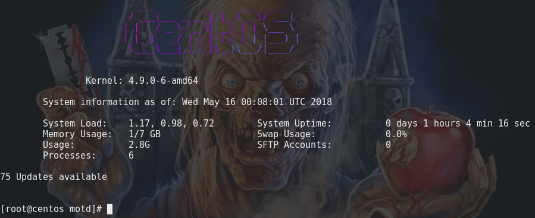

# Ubuntu-like Message of the Day for CentOS
Automate checking for updates and have them emailed, with a useless stylized & colored figlet screen - just because.

Will also work on other Redhat-based systems like Fedora and derivatives.



*Dependencies*
* figlet
* lolcat
* EPEL Repository

If you do not have EPEL repo enabled (or are unsure if you do), first run (as root/sudo):
```bash
yum install epel-release
```
Then, install dependencies:
```bash
yum install figlet
yum install rubygems
gem install lolcat
```

**Mimic the Ubuntu setup**
```bash
mkdir /etc/update-motd.d/
```

**Place the following scripts in your preferred directory (and take note of their path), ex: /home/user/motd/**
* [update-check.sh](update-check.sh)
* [motd.sh](motd.sh)

**Make the scripts executable**
```bash
chmod +x update-check.sh && chmod +x motd.sh
```

**Edit the profile to assign a motd**
```bash
nano /etc/profile
```

**Add to the bottom of /etc/profile:**
```bash
/home/motd.sh
```

**Add a cron as root, which will trigger a check for updates and cache the number of updates available**
```bash
crontab -e
```

**Set your desired time for the update script to run**
```bash
28 2 * * * /home/user/update-check.sh
```

Done.
